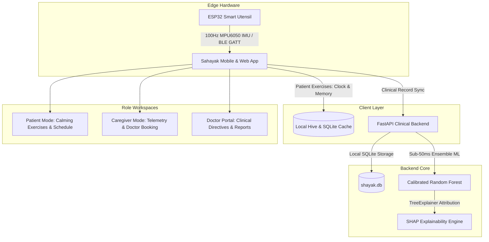

# 🌿 SAHAYAK—AI (सहायक)
> **Cognitive & Memory Support Companion for Elderly Dementia Patients, Family Caregivers, and Clinicians**
> 
> *Offline-First · Multilingual · ML Biomarker Analysis & SHAP Explainability · Active Kinematic ESP32 Stabilization*

---

<p align="center">
  
  
  
  
  
  
</p>

---

## 📌 Executive Summary

**SAHAYAK—AI** is an ecosystem built to bridge the gap between elderly dementia patients, family caregivers, and clinical neurologists across India. Featuring **offline-first local persistence**, adaptive difficulty scaling, real-time kinematic tremor stabilization, and explainable ML risk assessments, SAHAYAK—AI delivers holistic care tailored to multi-generational accessibility.

---

## 🏛️ System Architecture



---

## ✨ Key Features & Tri-Role Design System

### 🧑‍🦳 1. Patient Workspace (Serene Sage & Calming Visuals)
* **Gentle Cognitive Exercises**:
  * **Clock Drawing Test (CDT)**: Canvas capturing $(x, y, t, \text{velocity}, \text{hesitations})$.
  * **Memory Match & Story Recall**: Working memory games with adaptive difficulty.
  * **Spot the Difference & Local Language Naming**: Culturally familiar multi-lingual prompts.
* **Routine & Reminders**: High-contrast, large-touch target checklist with voice audio read-aloud.
* **Offline-First Resilience**: Instant response powered by local Hive & SQLite sync.

### 👥 2. Caregiver Dashboard (Mint & Warm Terracotta)
* **Clinical Appointment Booking**: Direct scheduling with choice of specialty, format (In-Person / Telehealth), preferred date, time slots, and symptom notes.
* **Live Telemetry & Motor Trends**: Virtual 3D attitude indicator (Roll, Pitch, Yaw), vertical acceleration ($a_z$), and 20 kHz PWM counter-thrust active stabilization monitoring.
* **Doctor Directive Sync**: Instant access to doctor prescriptions, medical feedback, and care plans.

### 🩺 3. Doctor Portal (Clinical Blue)
* **Patient Selection & Medical History**: Longitudinal tracking with persistent doctor notes.
* **Prescribe Directives & Adaptive Difficulty**: Set custom action items (e.g., daily 15-min Memory Story, hydration targets) and lock cognitive difficulty levels.
* **ML Risk Evaluation & SHAP Analysis**: Sub-50ms diagnostic classification with SHAP feature attribution waterfall.

---

## 🎨 Visual System & Tokens

* **Primary Forest Green**: `#124E3C` *(Headings, primary CTAs, active indicators)*
* **Primary Dark**: `#12302A` *(Hover and active states)*
* **Accent Orange**: `#D87236` *(Hero highlights, used sparingly)*
* **Page Background**: `#F0F6F0` *(Soft mint-white)*
* **Card Surface**: `#FCFCFC` *(Clean elevated surfaces)*
* **Clinical Accent (Doctor)**: Text `#184ED8` on `#BAD8FC` chip

---

## 📁 Repository Structure

```
SIH-main/
├── backend/                        # FastAPI Backend & ML Pipeline
│   ├── app/
│   │   ├── main.py                 # REST API Endpoints & FastAPI App
│   │   └── db.py                   # SQLite Schema, Repositories & Seeding
│   ├── shayak.db                   # SQLite Persistent Database
│   └── requirements.txt            # Python Dependencies
├── shayak_mobile/                  # Cross-Platform Flutter Frontend
│   ├── lib/
│   │   ├── models/                 # Data Models & Persistence (Patient, Feedback, Appointments)
│   │   ├── screens/                # Patient, Caregiver, Doctor & Registration Screens
│   │   ├── services/               # API Config, Local Database Service & Session Engine
│   │   ├── theme/                  # Design Tokens & Typography System
│   │   └── widgets/                # Top Bar, Sidebar, Cards & Action Components
│   └── pubspec.yaml                # Flutter Dependencies
└── firmware/                       # Hardware Firmware
    └── esp32_stabilization/        # Dual-Core FreeRTOS MPU6050 Stabilization Firmware
```

---

## ⚡ Quick Start Guide

### 1. 🐍 Backend API (FastAPI + SQLite)
```bash
# Navigate to backend
cd backend

# Install dependencies
pip install -r requirements.txt

# Start FastAPI server with live reload
python -m uvicorn app.main:app --reload --host 0.0.0.0 --port 8000
```
* **Interactive API Docs (Swagger UI)**: Open `http://localhost:8000/docs`

### 2. 📱 Mobile & Web App (Flutter)
```bash
# Navigate to mobile app
cd shayak_mobile

# Install packages
flutter pub get

# Run on Web (Chrome)
flutter run -d chrome

# Run on Connected Android Device
flutter run -d <device_id>
```

### 3. 🔌 Hardware Firmware (ESP32)
1. Open `firmware/esp32_stabilization/esp32_stabilization.ino` in Arduino IDE or PlatformIO.
2. Connect your **ESP32 Dev Module** with MPU6050 IMU via USB.
3. Flash and monitor output at **115200 baud**.

---

## 🔄 Recent Updates

| Date | Change |
|------|--------|
| Sep 2026 | ✅ Fixed `RenderFlex` overflow in **Doctor Dashboard** patient selector dropdown — consolidated Row into single `Text` with `TextOverflow.ellipsis` |
| Sep 2026 | ✅ Fixed overflow in **Doctor Dashboard** physician feedback history, header tags, appointment cards |
| Sep 2026 | ✅ Fixed overflow in **Caregiver Workspace** appointment headers and date/phone rows |
| Sep 2026 | ✅ Restored original **Landing Screen** design ("Support for memory. Made human.") |
| Sep 2026 | ✅ Added responsive `Wrap` layouts across all dashboard screens for physical device compatibility |

---

## 📄 License

Distributed under the **MIT License**. See `LICENSE` for details.
