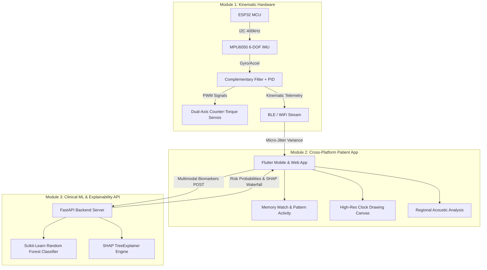

<div align="center">

# 🌿 SHAYAK—AI
### Accessible Cognitive Health, Multimodal Kinematic Fusion & Explainable Caregiver Support Platform

[](https://fastapi.tiangolo.com)
[](https://flutter.dev)
[](https://python.org)
[](https://shap.readthedocs.io)
[](https://opensource.org/licenses/MIT)

*A serene, non-stigmatizing assistive ecosystem designed for individuals with Parkinson's and mild cognitive decline, with caregivers close by.*

---

</div>

## 📖 Overview

**SHAYAK-AI** is an end-to-end assistive medical technology solution engineered to bridge active physical tremor stabilization with non-invasive cognitive health monitoring.

The system combines:
1. **Active Kinematic Stabilization (ESP32)**: Hardware-level dual-axis active stabilization counteracting hand tremor (4–12 Hz) using closed-loop PID control and MPU-6050 IMU sensors.
2. **Serene Patient App (Flutter)**: A WCAG AAA high-contrast, tremor-tolerant mobile/web interface offering daily cognitive exercises (Memory Match, Clock Drawing Test, cultural pattern sequences, voice acoustic analysis).
3. **Caregiver & Clinical Explainability Engine (FastAPI + SHAP)**: Sub-50ms diagnostic risk probability estimation and real-time SHAP (*SHapley Additive exPlanations*) waterfall charts empowering clinicians and caregivers without clinical assumptions.

---

## 🏗️ System Architecture



---

## ✨ Key Features

### 1. 📱 Patient Experience (Calm & Accessible)
- **Serene Nature Palette**: Designed with soft sage ivory (`#F4F7F4`), deep forest green (`#134E3F`), and warm terracotta (`#D97736`).
- **Tremor-Tolerant Interaction**: 56px+ large touch targets, low-pass touch jitter dampening, and high-contrast demarcations.
- **Audio Narration ("Listen")**: One-tap text-to-speech audio guidance for all instructions.
- **Cognitive Games**:
  - **Memory Match**: Gentle card pairing exercise with positive reinforcement.
  - **Clock Drawing Test (CDT)**: Canvas capturing stroke velocity, hesitation pauses (>500ms), and micro-jitter variance.
- **Offline-First Resilience**: Local caching with Hive for complete functionality without active internet connection.

### 2. 👩‍⚕️ Caregiver Workspace & Clinical Explainability
- **Non-Medical View Overview**: Simple, reassuring metrics (Games Completed, Average Accuracy, Response Latency, Adaptive Difficulty Tier).
- **Session Performance Trends**: 7-session cognitive activity tracking.
- **Live SHAP Waterfall Attributions**: Visualizes exact positive and negative feature contributions toward diagnostic risk.
- **Actionable Guidance**: Contextual lifestyle and cognitive exercise recommendations.

### 3. ⚙️ Hardware Active Stabilization
- **ESP32 Microcontroller**: Multi-tasking FreeRTOS implementation running 100 Hz sampling.
- **Closed-Loop Counter-Torque**: Real-time inverted servo compensation cancelling 4–12 Hz Parkinsonian tremors.
- **Kinematic Metric Computation**: Calculates path deviation angular velocity and tremor variance.

---

## 🛠️ Tech Stack

| Layer | Technology | Description |
|---|---|---|
| **Mobile & Web UI** | Flutter 3.47+ / Dart 3.13+ | Cross-platform (Android, iOS, Web, Windows) |
| **Styling & Fonts** | Google Fonts (Plus Jakarta Sans, Inter) | Serene, accessible typography |
| **Backend API** | FastAPI, Uvicorn, Pydantic v2 | High-throughput REST API with OpenAPI docs |
| **Machine Learning** | Scikit-Learn | Calibrated Multi-Class Random Forest Model |
| **Explainability (XAI)**| SHAP (TreeExplainer) | Sub-50ms local feature importance attribution |
| **Hardware Firmware** | C++ / Arduino / ESP-IDF | ESP32 dual-axis servo PID stabilization |
| **Local Persistence** | Hive NoSQL | Offline edge caching |

---

## 🚀 Quick Start Guide

### Prerequisites
* **Python 3.10+**
* **Flutter SDK 3.24+**
* **Git**

---

### 1. Run the Clinical AI Backend

```powershell
# Navigate to backend
cd backend

# Create & activate virtual environment
python -m venv .venv
.venv\Scripts\activate      # On Windows
source .venv/bin/activate    # On Linux/macOS

# Install dependencies
pip install -r requirements.txt

# Start FastAPI server
uvicorn app.main:app --host 127.0.0.1 --port 8000 --reload
```

* 📚 **Interactive Swagger API Docs**: [http://127.0.0.1:8000/docs](http://127.0.0.1:8000/docs)
* 🩺 **Health Check**: [http://127.0.0.1:8000/health](http://127.0.0.1:8000/health)

---

### 2. Run the Mobile & Web App

```powershell
# Navigate to Flutter project
cd shayak_mobile

# Install packages
flutter pub get

# Run on Chrome (Web Preview)
flutter run -d chrome

# Or run on connected Android Device
flutter run
```

---

### 3. Build Production Android APK

To generate the standalone `.apk` for direct installation on Android phones:

```powershell
cd shayak_mobile
flutter build apk --release
```

Output file: `shayak_mobile/build/app/outputs/flutter-apk/app-release.apk`

---

## ☁️ Deployment

* **Backend Cloud Deployment**: Ready for 1-click deployment on **Render**, **Railway**, or **Google Cloud Run** using [`backend/Dockerfile`](file:///c:/Users/souha/OneDrive/Desktop/SIH/backend/Dockerfile) and [`backend/Procfile`](file:///c:/Users/souha/OneDrive/Desktop/SIH/backend/Procfile).
* **Web Deployment**: Static production assets in `shayak_mobile/build/web` deployable directly to **Vercel** or **Netlify Drop**.
* Detailed step-by-step instructions in [`DEPLOYMENT.md`](file:///c:/Users/souha/OneDrive/Desktop/SIH/DEPLOYMENT.md).

---

## 📂 Repository Structure

```
SIH/
├── backend/
│   ├── app/
│   │   ├── main.py              # FastAPI endpoints & CORS configuration
│   │   ├── ml_engine.py         # Scikit-learn model & SHAP TreeExplainer
│   │   └── models.py            # Pydantic schemas & clinical models
│   ├── Dockerfile               # Production Docker container definition
│   ├── Procfile                 # Cloud web service entrypoint
│   ├── requirements.txt         # Python dependencies
│   └── test_inference.py        # ML & explainability test suite
│
├── shayak_mobile/
│   ├── lib/
│   │   ├── main.dart            # Entrypoint & Hive persistence
│   │   ├── models/              # Kinematic & assessment point models
│   │   ├── screens/
│   │   │   ├── landing_screen.dart             # Welcome landing page
│   │   │   ├── patient_home_screen.dart        # Patient daily home & activities
│   │   │   ├── memory_match_screen.dart        # Interactive Memory Match activity
│   │   │   ├── clock_canvas_screen.dart        # Clock drawing test canvas
│   │   │   └── caregiver_workspace_screen.dart # Caregiver dashboard & SHAP view
│   │   ├── theme/
│   │   │   └── app_theme.dart   # Sage, forest green & terracotta design system
│   │   └── widgets/
│   │       ├── app_top_bar.dart # Responsive adaptive top bar
│   │       └── app_sidebar.dart # Patient & Caregiver navigation sidebars
│   ├── pubspec.yaml             # Flutter dependencies
│   └── web/                     # Web deployment assets & vercel.json
│
├── firmware/
│   ├── README.md                # Circuit schematics & hardware guide
│   └── esp32_stabilization/
│       └── esp32_stabilization.ino # ESP32 active counter-torque stabilization
│
├── DEPLOYMENT.md                # Production cloud & APK deployment guide
└── README.md                    # Project documentation
```

---

## 🔒 Privacy & Safety Disclaimer

* **Privacy by Design**: All patient telemetry, kinematic parameters, and drawing coordinates are processed locally on-device and on local secure edge endpoints.
* **Clinical Decision Support**: SHAYAK-AI is designed as an assistive and supportive tool for individuals and caregivers, providing explainable biomarker tracking without replacing licensed clinical diagnosis.

---

<div align="center">
  <sub>Developed for Smart India Hackathon (SIH). Empowering dignified daily living through accessible AI.</sub>
</div>
