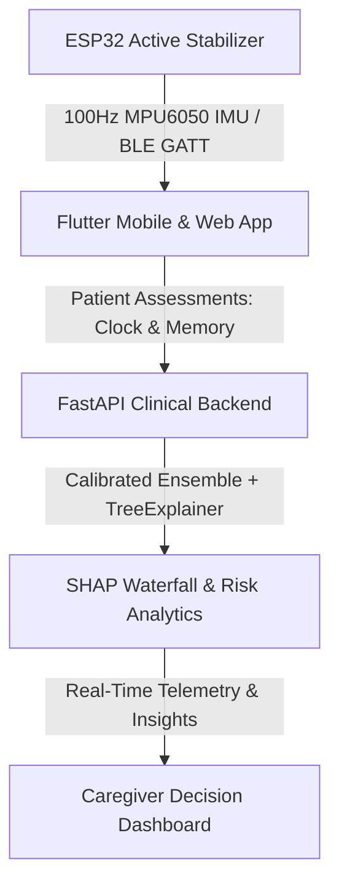

# 🌿 SHAYAK-AI: Accessible Cognitive Health & Kinematic Stabilization Platform

> **Smart India Hackathon (SIH)** — Multimodal Early Cognitive Impairment Detection, Explainable AI (SHAP), and Active Kinematic Utensil Stabilization.

---

## 🏛️ System Architecture



### 1. **FastAPI Clinical ML Engine (`backend/`)**
* **Calibrated Random Forest Ensemble**: Evaluates 11 multi-modal biomarkers including clock contour circularity, drawing hesitation pauses, stroke velocity, ESP32 micro-jitter variance, and acoustic vocal features.
* **SHAP Explainability Waterfall**: Generates mathematically grounded local feature attributions ($P(\text{Impairment}) = \text{Base} + \sum \text{SHAP}_i$) to explain risk factors directly to clinicians and caregivers.
* **REST Endpoints**:
  - `GET /health`: Health check and model readiness probe.
  - `GET /api/v1/meta/features`: Catalog of biomarkers, units, and population baselines.
  - `POST /api/v1/clinical/evaluate`: Multimodal diagnostic assessment and SHAP waterfall generation.
  - `POST /api/v1/kinematic/telemetry`: ESP32 IMU packet ingestion and tremor severity classification.
  - `GET /api/v1/patient/{id}/history`: Longitudinal session history and progression trends.
  - `POST /api/v1/patient/{id}/session`: Direct session recording from mobile exercises.

### 2. **Elderly & Caregiver Flutter Application (`shayak_mobile/`)**
* **Patient Experience**:
  - **Daily Home Hub**: Personalized greeting, audio narration ("Listen" button), quick action chips, and caregiver contact.
  - **Games & Activities Hub**:
    - **Memory Match Activity**: Working memory card matching with turn tracking and celebration dialogs.
    - **Clock Contour Assessment**: High-resolution interactive canvas capturing $(x, y, t, \text{pressure})$ with real-time velocity, hesitations, and micro-jitter scoring.
    - **Cultural Pattern Sequence**: Visual-spatial memory rhythm session.
  - **Daily Schedule & Reminders**: Interactive checklist with audible read-aloud support.
  - **Progress & Motor Trends**: 7-day streak tracker, completed sessions log, and motor stability indices.
* **Caregiver Experience**:
  - **Overview Dashboard**: Selected patient profile, 4 key metrics, 7-session cognitive performance trend chart, support notes.
  - **AI Decisions & Interactive Simulator**: Real-time diagnostic probability badges, SHAP waterfall drivers, and **interactive live sliders** to simulate biomarker adjustments on the fly.
  - **Care Plan & Medication Schedule**: Medication dosage management with active switches.
  - **ESP32 Kinematic Device Telemetry**: Real-time virtual attitude indicator (Roll, Pitch, Yaw), vertical acceleration $a_z$, and active 20 kHz PWM duty cycle counter-thrust monitor.

### 3. **Active Kinematic Firmware (`firmware/esp32_stabilization/`)**
* **Dual-Core FreeRTOS Architecture**:
  - **Core 0 (100 Hz)**: Hard real-time MPU6050 acquisition, 6-DOF complementary filter sensor fusion, and active counter-thrust PID controller ($F_{\text{net}} = 0$).
  - **Core 1 (25 Hz)**: Non-blocking BLE GATT server streaming telemetry packets to the mobile app.

---

## 🚀 Quick Start Guide

### 1. Running the FastAPI Backend
```bash
cd backend
pip install -r requirements.txt
python -m uvicorn app.main:app --reload --host 0.0.0.0 --port 8000
```
* **Interactive Swagger UI**: Visit `http://127.0.0.1:8000/docs`
* **Run Test Suite**: `python test_inference.py`

### 2. Running the Flutter Mobile / Web App
```bash
cd shayak_mobile
flutter pub get
flutter run -d chrome     # Run as Web App
# OR
flutter run               # Run on connected Android device / emulator
```

### 3. ESP32 Arduino Firmware
1. Open `firmware/esp32_stabilization/esp32_stabilization.ino` in Arduino IDE or PlatformIO.
2. Select **ESP32 Dev Module** and upload via USB.
