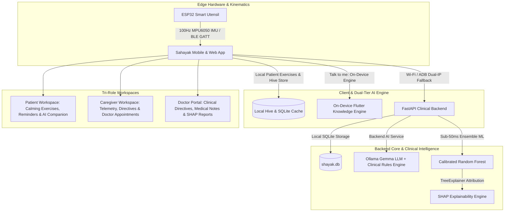

# 🌿 SAHAYAK—AI (सहायक)
> **AI-Based Cognitive Gaming, Neural Conversational Companion & Memory Assistance Platform for Elderly Dementia Patients in North Eastern Region (NER)**
> 
> *Offline-First · Multilingual & NER Regional Context · Dual-Tier On-Device Knowledge Engine & Ollama LLM · ML Biomarker Analysis & SHAP Explainability · Active Kinematic ESP32 Tremor Stabilization*

---

<p align="center">
  
  
  
  
  
  
  
</p>

---

## 📌 Problem Statement & Executive Summary

In India, over **8.8 million elderly individuals** live with dementia, with over **200,000+ undiagnosed cases in the North Eastern Region (NER)** across Assam, Meghalaya, Manipur, Mizoram, Nagaland, Tripura, Arunachal Pradesh, and Sikkim. Terrain barriers, limited clinical infrastructure, and low awareness leave patients and family caregivers isolated.

**SAHAYAK—AI (सहायक)** is an offline-first, tri-role healthcare platform specifically architected for dementia care management in NER and across India:
1. **Comprehensive Dementia Clinical Knowledge Engine**: Built-in 100% offline knowledge engine answering clinical stages (Reisberg GDS 1–7), medical management (Donepezil, Memantine, Galantamine, Rivastigmine), diagnostic tools (MMSE, MoCA, CDT, GDS), non-pharmacological interventions, and caregiver safety strategies.
2. **Tri-Role Ecosystem (Patient, Caregiver, Doctor)**: Tailored interfaces for patients (calming cognitive games, daily memory checklists, voice companion), caregivers (appointment booking, live telemetry, doctor directive sync), and clinicians (SHAP diagnostic attribution, cognitive level locking, longitudinal patient history).
3. **Dual-Tier AI Companion ("Talk to me")**: Runs locally on mobile and backend. Combines an instant local rule & knowledge fallback engine (`companion_service.dart` / `companion_service.py`) with local Ollama + Gemma LLM neural inference, guaranteeing 100% zero-latency offline response.
4. **Hardware-Integrated Active Tremor Stabilization**: Real-time kinematic stabilization firmware using ESP32 & MPU6050 IMU sensor delivering 20 kHz counter-thrust PWM signals for active spoon/utensil motor control.

---

## 🏛️ System Architecture



---

## ✨ Tri-Role Core Features & Capabilities

### 🧑‍🦳 1. Patient Workspace (Serene Sage & Calming Visuals)
* **Dual-Tier AI Companion ("Talk to me")**:
  * **Empathetic & Validation Therapy**: Answers dementia stages, medications, daily guidance, and reminiscence prompts without reality-confrontation.
  * **Dual-IP & Offline Resilience**: Connects to FastAPI backend over USB ADB (`127.0.0.1:8000`) or Wi-Fi (`192.168.29.29:8000`). If offline, falls back instantly to the built-in Dart Knowledge Engine.
  * **Voice Text-To-Speech (TTS)**: One-tap audio read-aloud for all conversational responses.
* **Gentle Cognitive Exercises**:
  * **Clock Drawing Test (CDT)**: Interactive canvas assessing executive control and visuospatial orientation.
  * **Memory Match & Story Recall**: Working memory training with adaptive difficulty scaling.
  * **Spot the Difference & Local Language Naming**: Cultural context prompts tailored for NER elders.
* **Routine & Daily Reminders**: High-contrast, large-touch checklist with clear TTS audio narration.

### 👥 2. Caregiver Dashboard (Warm Terracotta & Mint)
* **Clinical Appointment Booking**: Scheduling interface with specialty selection, format choice (In-Person / Telehealth), custom slot selection, and symptom notes.
* **Live Kinematic Tremor Telemetry**: Real-time 3D attitude monitoring (Roll, Pitch, Yaw), vertical acceleration ($a_z$), and 20 kHz counter-thrust PWM feedback.
* **Doctor Directive Sync**: Immediate viewing of doctor prescriptions, care plans, and daily cognitive activity targets.

### 🩺 3. Doctor Portal (Clinical Blue)
* **Longitudinal Patient History**: Full access to cognitive scores, exercise completion trends, and clinical notes.
* **Clinical Directives & Cognitive Locking**: Set patient daily goals and lock cognitive game difficulty levels.
* **ML Biomarker Assessment & SHAP Explainability**: Sub-50ms diagnostic classification paired with SHAP waterfall feature attribution plots.

---

## 🧠 Clinical Knowledge Engine (Dementia & Project Intelligence)

The chatbot (Python backend + Flutter mobile app) is trained with deep domain knowledge covering:
* **Dementia Disease Details**: Pathophysiology, 7 stages of Reisberg Global Deterioration Scale (GDS), distinction from normal aging, and epidemiology in NER.
* **Dementia Subtypes**: Alzheimer's Disease, Vascular Dementia, Lewy Body Dementia (LBD), Frontotemporal Dementia (FTD), Mixed Dementia, and Parkinson's Disease Dementia.
* **Pharmacological & Clinical Management**: AChE inhibitors (Donepezil, Rivastigmine, Galantamine) and NMDA antagonists (Memantine).
* **Caregiver & Safety Strategies**: Wandering prevention, sundowning management, communication validation rules, and burnout mitigation.
* **ESP32 Tremor Stabilization Hardware**: ESP32 microcontroller, MPU6050 IMU sensor (100Hz sampling), and 20 kHz PWM motor stabilization.

---

## 🎨 Visual System & Tokens

* **Primary Forest Green**: `#124E3C` *(Headings, primary CTAs, active indicators)*
* **Primary Dark**: `#12302A` *(Hover and active states)*
* **Accent Orange**: `#D87236` *(Hero highlights, used sparingly)*
* **Page Background**: `#F0F6F0` *(Soft mint-white)*
* **Card Surface**: `#FCFCFC` *(Clean elevated surfaces)*
* **Clinical Accent (Doctor)**: Text `#184ED8` on `#BAD8FC` chip

---

## 📁 Repository Structure

```
SIH-Final-Round/
├── backend/                        # FastAPI Backend & ML Pipeline
│   ├── app/
│   │   ├── main.py                 # REST API Endpoints & FastAPI App
│   │   ├── companion_service.py    # Offline Ollama + Gemma LLM & Knowledge Engine
│   │   ├── db.py                   # SQLite Schema, Repositories & Seeding
│   │   └── ml_engine.py            # Scikit-Learn ML Model & SHAP Explainability
│   ├── shayak.db                   # SQLite Persistent Database
│   └── requirements.txt            # Python Dependencies
├── shayak_mobile/                  # Cross-Platform Flutter Frontend
│   ├── lib/
│   │   ├── models/                 # Data Models (Patient, Directives, Appointments)
│   │   ├── screens/                # Patient, Caregiver, Doctor & Auth Screens
│   │   ├── services/               # API Config, Companion Service, DB & TTS Audio
│   │   ├── theme/                  # Design Tokens & Typography System
│   │   └── widgets/                # Companion Modal, Top Bar, Sidebar & Action Cards
│   └── pubspec.yaml                # Flutter Dependencies
└── firmware/                       # Edge Hardware Firmware
    └── esp32_stabilization/        # FreeRTOS MPU6050 IMU Stabilization Firmware
```

---

## ⚡ Quick Start Guide

### 1. 🐍 Backend API (FastAPI + SQLite)
```bash
# Navigate to backend
cd backend

# Install dependencies
pip install -r requirements.txt

# Start FastAPI server
python -m uvicorn app.main:app --reload --host 0.0.0.0 --port 8000
```
* **Interactive API Docs**: Open `http://localhost:8000/docs`

### 2. 🤖 Local Ollama LLM Service (Optional)
```bash
# Start Ollama service
ollama serve

# Pull local Gemma model
ollama pull gemma2:2b
```

### 3. 📱 Mobile & Web App (Flutter)
```bash
# Navigate to mobile app
cd shayak_mobile

# Install dependencies
flutter pub get

# Run on Web (Chrome)
flutter run -d chrome

# Build Debug APK for Android
flutter build apk --debug --android-skip-build-dependency-validation

# Deploy directly to connected Android device
adb install -r ../build/app/outputs/flutter-apk/app-debug.apk
```

---

## 🔄 Recent Updates

| Date | Change |
|------|--------|
| Sep 2026 | ✅ Fully synced **Clinical & Domain Knowledge Engine** across Python backend (`companion_service.py`) and Flutter app (`companion_service.dart`), enabling 1-click comprehensive dementia answers online & offline |
| Sep 2026 | ✅ Built and deployed updated debug APK (`SAHAYAK_AI.apk`) to physical Android device via USB ADB (`f6c6031d`) |
| Sep 2026 | ✅ Implemented **Instant On-Device Validation Therapy Engine** (`companion_service.dart`) with zero timeout failure; provides immediate empathetic conversational replies both online and 100% offline |
| Sep 2026 | ✅ Added **Local Wi-Fi Network Resolution** (`192.168.29.29:8000` + ADB reverse `127.0.0.1:8000`) enabling seamless mobile app access to backend over Wi-Fi without USB cables |
| Sep 2026 | ✅ Resolved Flutter compilation errors: updated `CardThemeData` in `app_theme.dart`, promoted box variable before awaits in `app_sidebar.dart`, and upgraded `google_fonts` to `^8.2.1` |
| Sep 2026 | ✅ Fixed **100% of RenderFlex yellow overflow spots** across all mobile screens (`companion_modal.dart`, `patient_home_screen.dart`, `doctor_dashboard_screen.dart`, `caregiver_workspace_screen.dart`, `patient_progress_dashboard.dart`) |
| Sep 2026 | ✅ Enabled `android:usesCleartextTraffic="true"` and added **Dual-IP Fallback** (`127.0.0.1` + local Wi-Fi) for instant mobile-to-LLM communication |
| Sep 2026 | ✅ Bound FastAPI Uvicorn backend to `0.0.0.0:8000` to serve both USB ADB bridge and Wi-Fi network requests |
| Sep 2026 | ✅ Integrated live **Ollama + Gemma 2B LLM** real-time neural conversational companion ("Talk to me") with audio narration |

---

## 📄 License

Distributed under the **MIT License**. See `LICENSE` for details.


